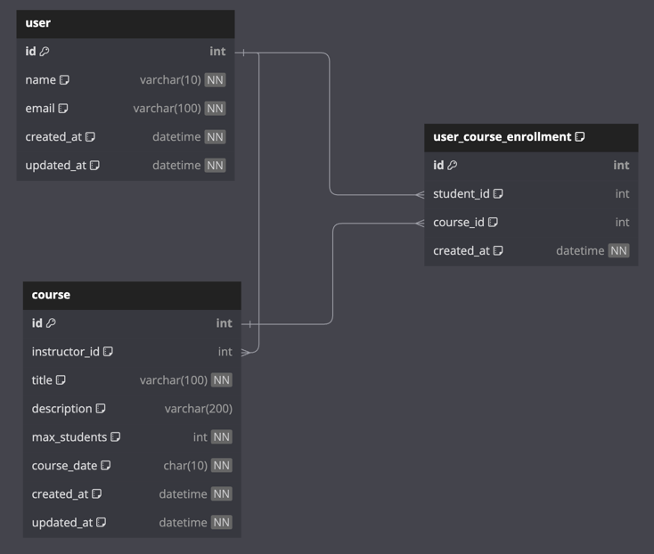

# 특강 신청 서비스

# 1. Entity-Relationship Diagram (ERD)



## 1-1. user 엔티티
`user` 엔티티를 `student`와 `instructor`로 분리하지 않았습니다.
- 유연성: 항해플러스 토요일 특강은 누구든 강연자로 나설 수 있습니다. 또한, 특강이라는 특성상 이번주에는 수강생이지만 다음주에는 강연자가 될 수 있기 때문에 명확히 구분하지 않았습니다.
- 확장성: 만약 특강이 아닌 일반 강의가 추가된다면 구체적인 강사 정보(ex. 강사 소개, 강사 커리어 등)이 필요하기에 추가 엔티티가 필요합니다. 

## 1-2. user-course 관계
`user_course_enrollment` 엔티티를 통해 user와 course의 다대다 관계를 구현했습니다.
- 한 학생이 여러 특강을 수강하고, 한 특강에 여러 학생이 수강할 수 있는 구조입니다.
- 중복 신청 방지: `(student_id, course_id)` 컬럼을 `unique`로 설정하여 특강 중복 신청을 방지합니다.

## 1-3. course 엔티티
`course` 엔티티는 특강 정보를 담고 있습니다.
- 수강 인원 제한: `max_students` 컬럼을 통해 수강 인원을 제한합니다. 매 특강(ex. 온라인, 오프라인 장소에 따라)마다 인원이 바뀔 수 있기 때문에 DB default 값은 설정하지 않습니다.
  - 날짜는 `yyyy-MM-dd`(e.g. 2024-12-25) 형식이기 때문에 `CHAR(10)`으로 고정시켰습니다.
- 특강은 토요일마다 열립니다. 단, 평일이나 일요일에 특강이 열릴 수도 있기 때문에 관련 constraint는 추가하지 않았습니다. (확장 가능 고려)

# 2. Requirements

RDBMS는 MariaDB를 Docker로 띄워 사용합니다.

## 2-1. MariaDB Container 설치
1. Docker Image 다운로드
   ```
   docker pull mariadb:latest
   ```
2. Docker Container 실행
   ```
   docker run -d --name hh-mariadb -e MARIADB_ROOT_PASSWORD=1234 -p 23306:3306 mariadb:latest
   ```

3. MariaDB 접속
   ```
   docker exec -it hh-mariadb mariadb -uroot -p
   ```

4. database 스키마 생성
   ```
   create database hh_special_course;
   use hh_special_course;
   ```

5. ddl 실행
   ```
   source /src/main/resources/ddl/hh_special_course.sql
   ```

### 주의사항
1. dbdiagram 함수 사용시에는 반드시 백틱 사용해야 한다. e.g. `current_timestamp()`

# 참고
- https://dkswnkk.tistory.com/697